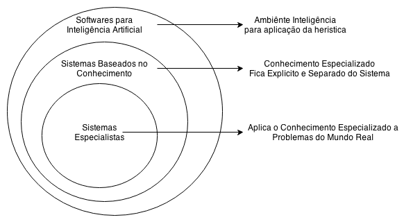
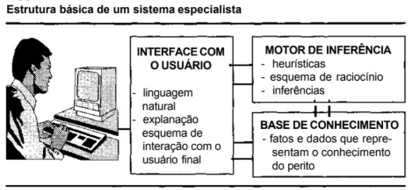

# Atividade 
## Sistema Especialista Dinossauro: Um sistema nem tão especialista assim

Este fork tem origem no código https://github.com/LucasJaenisch/sistema-especialista-dinossauro e agradeçemos antecipadamente sua disponibilização como código aberto.

Para os alunos do curso de IA segue as instruções para o exercício:
1) Coloque o código para executar, excutando o comando python.exe main.py
2) Análise rapidamente todos os arquivos desse código fonte,  inclusive o pdf
3) Converse com esse "sistema especialista" e responda as questões abaixo. 

Coloque as respostas as perguntas abaixo(Q1, Q2, Q3 e Q4) no arquivo resposta.md que está no raiz desse repositório e efetue o commit

Q1-Este sistema especialista (sistema-especialista-dinossauro) faz as perguntas de forma dinâmica ou seja nem sempre as mesmas perguntas são exibidas ao usuário, ou sempre as mesmas perguntas são exibidas ao usuário, na mesma ordem?  (sim, não)

Q2-Este sistema especialista (sistema-especialista-dinossauro) usa a técnica de encadeamento para frente e encademento para trás, ou nenhuma delas? (sim, não ou não sei)

Q3-Este sistema especialista (sistema-especialista-dinossauro) utiliza uma base de conhecimento baseada em regras do tipo "SE (antecedente)-ENTÃO (consequente)"? (sim, não ou não sei)

(opcional) Q4-Qual técnica esse "sistema especialista" utiliza? 

## Submissão

O resultado desse exercício que será avaliado será: O código que estará no seu repositório no final do prazo.

# Teoria sobre Sistemas especialistas 

Parte desse texto foi retirado do repositório https://github.com/tonussi/se-prolog

Um sistema especialista é um sistema computacional com uma estratégia de resolução de problemas.



# Arquitetura 

Base de Conhecimentos

É basicamente uma série de regras e calculos que serão feitas para resolver problemas que são encontrados por sistemas mais sofísticados mas que não tem tanta firmeza de decisão. 

```prolog
IF   | <algo acontecer> ; Antecendente
THEN | <faça isso>      ; Consequencia
```

A máquina de inferências é um programa de computador desenhado para produzir um dicernimento sobre regras. Existem muitos tipos de abordagens lógicas, via lógica proposicional, predicados de ordem >= 1, lógica epistêmica, lógica modal, lógica temporal, lógica fuzzy, lógica probabilistica (implementada por Redes de Bayesianas), dentre outras. A proposicional é mais usada, por ser natural nos seres humanos, e é expressada com silogismos. O sistema especialista que usa tal lógica é também chamado de ordem zero-ésima. Com lógica, o programa é capaz de gerar novas informações vindas do conhecimento na base de regras e informações.

- __Base de Conhecimento__: Regras IF-THEN-ELSE + Matemática.
- __Base de Dados__: Dados específicos para o problema.
- __Mecânismo de Inferência__: O núcleo pensante.
- __Interface de Usuário__: Faz o diálogo.



# Referências

[Expert System at Wiki](https://en.wikipedia.org/wiki/Expert_system)

[Building Expert Systems in Prolog](http://www.amzi.com/ExpertSystemsInProlog/index.htm)

